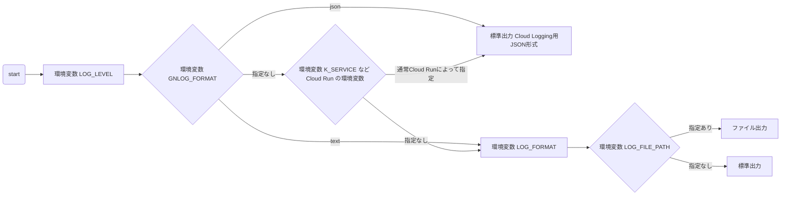

# py-gn-log

py-gn-log は Cloud Run 環境とローカルの開発環境を考慮した Groovenauts 社内標準(にしようとしている) の Python ロギング設定ライブラリです。Cloud Run 環境では JSON 形式の構造化されたログを出力することで Cloud Logging にログを生成します。

## インストール

### uvを使う場合

```
uv add git+ssh://git@github.com/tengine/py-gn-log
```

ブランチを指定する場合

```
uv add git+ssh://git@github.com/tengine/py-gn-log --branch (ブランチ名)
```

### 依存ライブラリの版について

py-gn-log は [python-json-logger](https://github.com/nhairs/python-json-logger) に依存しており、動作確認した major に上限を付けて宣言しています (`python-json-logger>=4.0.0,<5`)。python-json-logger の major が上がったときは py-gn-log 側で互換性を確認してから上限を上げます。

ロックファイルを持たず、Docker のビルドのたびに `pip install` で依存を解決する構成のプロジェクトでは、推移依存の版が変わって起動に失敗することを防ぐため、利用側でも `python-json-logger` の版を明示して固定することを推奨します。

## 使い方

### 基本的な使い方

```python
import logging
from gnlog import Initializer

# ロギングを初期化
initializer = Initializer(log_level=logging.INFO)

# ロガーを取得して使用
logger = initializer.apply(__name__)
logger.info("Application started")
logger.error("An error occurred")
```

`__name__` は呼び出すモジュールの名前(この場合は .py ファイルの名前から拡張子を除いたもの)を表す特殊な変数です。詳しくは [Python チュートリアル » 6. モジュール](https://docs.python.org/ja/3/tutorial/modules.html) あるいは [Python 言語リファレンス » 3. データモデル » module.\_\_name\_\_](https://docs.python.org/ja/3/reference/datamodel.html#module.__name__) を参照してください。

### ルートロガーの level について

`Initializer()` はハンドラの level とあわせてルートロガーの level も設定します (`logging.basicConfig(level=...)` と同じ振る舞い)。そのため `apply()` していないモジュールのロガー (`logging.getLogger(__name__)` で取得しただけのもの) からの INFO / DEBUG も出力されます。

ルートロガーの level を変更したくない場合は `set_root_level=False` を指定してください。この場合、ルートロガーの level は Python の既定 (WARNING) のままなので、`apply()` していないロガーの INFO / DEBUG は出力されません。

```python
from gnlog import Initializer

initializer = Initializer(set_root_level=False)
```

### 環境変数による設定

#### 環境変数の使われ方




#### ログレベルの設定

環境変数 `LOG_LEVEL` でログレベルを指定できます。

```bash
export LOG_LEVEL=DEBUG
```

指定可能な値: `DEBUG`, `INFO`, `WARN`, `WARNING`, `ERROR`, `CRITICAL`

```python
from gnlog import Initializer

# 環境変数 LOG_LEVEL からログレベルを読み込む
initializer = Initializer()
logger = initializer.apply("my_app")
```

#### 出力形式の明示的な指定

環境変数 `GNLOG_FORMAT` で、Cloud Run 上かどうかによらず出力形式を指定できます。指定できる値は `json` (Cloud Logging 用の JSON 形式) と `text` (テキスト形式) です。それ以外の値を指定すると `Initializer()` が `ValueError` を送出します。未設定なら Cloud Run の環境変数の有無で自動判定します。

```bash
# ローカルや CI で Cloud Logging に取り込まれる形そのままの JSON 行を確認する
export GNLOG_FORMAT=json
```

コードから指定する場合は `Initializer(json=True)` / `Initializer(json=False)` を使います。引数は環境変数より優先されます。

```python
from gnlog import Initializer

initializer = Initializer(json=True)
```

なお、環境変数 `LOG_FORMAT` はテキスト形式の **format 文字列** を指定するものです。`LOG_FORMAT=json` のように形式名を設定すると format 文字列として解釈され `ValueError` になります。形式の切り替えには `GNLOG_FORMAT` を使ってください。

#### ログファイルへの出力

環境変数 `LOG_FILE_PATH` でログファイルのパスを指定できます。

```bash
export LOG_FILE_PATH=/var/log/myapp.log
```

#### ログフォーマットのカスタマイズ

環境変数 `LOG_FORMAT` でテキスト形式のログフォーマット (format 文字列) を指定できます。JSON 形式では使われません。

```bash
export LOG_FORMAT="%(asctime)s [%(levelname)s] %(message)s"
```

### Cloud Run での使用

環境変数 `K_SERVICE` が設定されている場合（Cloud Run 環境）、自動的に JSON 形式でログを出力します。
環境変数 `K_SERVICE` は Cloud Run によって自動的に設定されるため、特別な設定は不要です。詳しくは [Cloud Run > ガイド > コンテナランタイムの契約 > 環境変数](https://docs.cloud.google.com/run/docs/container-contract?hl=ja#env-vars) を参照してください。

```python
from gnlog import Initializer

# Cloud Run では自動的に JSON フォーマットが使用される
initializer = Initializer()
logger = initializer.apply("my_service")
logger.info("Service started", extra={"user_id": 123})
```

出力例:
```json
{
  "name": "my_service",
  "message": "Service started",
  "timestamp": "2025-01-15T10:30:45.123456Z",
  "severity": "INFO",
  "user_id": 123
}
```

### リクエスト / タスク単位の文脈を全ログ行に付ける

1 つのリクエストや 1 つのタスクの処理中に出るログ行を、あとから 1 つの ID で串刺しにしたい場面 (エラー応答に載せた ID から Cloud Logging を引く、複数サービスにまたがる処理を追う等) のために、`gnlog.context` を用意しています。

`gnlog.context` は `contextvars.ContextVar` に置いた値を、`Initializer` の handler に付けた Filter が各ログ行に注入します。JSON 形式では置いたキー名がそのまま JSON のキーになります。`Initializer()` を呼ぶだけで有効になり、`apply()` していないロガーからの行にも付きます。

```python
import logging
from gnlog import Initializer, context

Initializer()
logger = logging.getLogger(__name__)

# with ブロックの間だけ付ける (抜けると、ここで置いたキーだけが元に戻る。入れ子にできる)
with context.bind(trace_id="4bf92f35", site="tokyo"):
    logger.info("処理開始")   # {"message": "処理開始", "trace_id": "4bf92f35", "site": "tokyo", ...}

# 明示的に消すまで残す (リクエストの開始時に set、終了時に clear する使い方)。
# bind のブロック内で set した値も、ブロックを抜けた後に残る
context.set(trace_id="4bf92f35")
logger.info("...")
context.clear()
```

- キー名は自由ですが、`message` や `name` など `LogRecord` が自前で持つ属性名は使えません (`ValueError` になります)。
- `extra={"trace_id": ...}` で明示的に渡した値は、文脈の値より優先されます。
- テキスト形式では、`LOG_FORMAT` に `%(trace_id)s` のように書いた場合のみ出力されます。ただし文脈が置かれていない行では該当の属性が無いため整形に失敗します。テキスト形式で使う場合は、常に値が置かれている状態を保つか、JSON 形式を使ってください。

#### スレッドをまたぐ場合

`threading.Thread` は ContextVar を継承しません。スレッドをまたいで文脈を引き継ぐには、生成元で `contextvars.copy_context()` を取り、その `run` 経由でスレッドの処理を呼び出してください。`asyncio` のタスクは生成時点の文脈を自動的に引き継ぎます。

```python
import contextvars
import threading

with context.bind(trace_id="4bf92f35"):
    ctx = contextvars.copy_context()
    t = threading.Thread(target=ctx.run, args=(work,))  # work() の中でも trace_id が付く
    t.start()
```

`concurrent.futures.ThreadPoolExecutor` を使う場合も同様に `executor.submit(ctx.run, work)` のように渡します。

### Cloud Trace と連携して全ログ行に trace を付ける

複数サービスにまたがる処理のログを串刺しにするには、独自の ID ではなく Cloud Trace の仕組みに寄せるのが自然です。Cloud Run はリクエストごとに `X-Cloud-Trace-Context` ヘッダ (と W3C の `traceparent`) を付け、Cloud Logging は JSON の特殊フィールド `logging.googleapis.com/trace` (`projects/<PROJECT_ID>/traces/<TRACE_ID>`)、`logging.googleapis.com/spanId`、`logging.googleapis.com/trace_sampled` を認識してログエントリを trace に紐付けます (Logs Explorer で同じ trace のログを横断表示でき、Cloud Trace とも繋がります)。

`gnlog.trace` は、受信ヘッダから trace を取り出して上の文脈 (`gnlog.context`) に特殊フィールドとして置く関数と、他サービスを呼び出すときに現在の trace をヘッダとして組み立てる関数を提供します。

```python
import logging
from gnlog import Initializer, trace

Initializer()
logger = logging.getLogger(__name__)

# 受信ヘッダから trace を取り出し、ブロックの間だけ全ログ行に付ける
with trace.bind_headers(request.headers, project_id="my-project"):
    logger.info("処理開始")
    # {"message": "処理開始",
    #  "logging.googleapis.com/trace": "projects/my-project/traces/4bf92f3577b34da6a3ce929d0e0e4736",
    #  "logging.googleapis.com/spanId": "00f067aa0ba902b7",
    #  "logging.googleapis.com/trace_sampled": true, ...}

    # 下流のサービスを呼ぶときは現在の trace をヘッダに載せる
    httpx.post(url, headers=trace.to_headers())
```

- プロジェクト ID は引数 `project_id`、無ければ環境変数 `GOOGLE_CLOUD_PROJECT` から取ります。**どちらにも無い場合は trace のフィールドを付けません** (既定値で本番のプロジェクト ID を持たないため)。その場合も `trace.current()` と `trace.to_headers()` は動作するので、下流への引き継ぎはできます。
- `traceparent` と `X-Cloud-Trace-Context` の両方があれば `traceparent` を優先します。ヘッダ名の大文字小文字は区別しません。
- `X-Cloud-Trace-Context` の SPAN_ID (10 進) は、Cloud Logging の `spanId` に合わせて 16 桁の 16 進に変換します。
- `trace.set(trace_context, project_id=...)` / `trace.clear()` で明示的に置いて消すこともできます。`trace.parse_traceparent()` / `trace.parse_cloud_trace_context()` / `trace.from_headers()` は解釈だけを行います。

#### FastAPI / Starlette の middleware の例

このライブラリは Web フレームワーク向けの middleware を同梱していません。次のように数行で書けます。

```python
from fastapi import FastAPI, Request
from gnlog import trace

app = FastAPI()

@app.middleware("http")
async def bind_trace(request: Request, call_next):
    with trace.bind_headers(request.headers):  # project_id は GOOGLE_CLOUD_PROJECT から
        return await call_next(request)
```

`asyncio` のタスクは生成時点の文脈を引き継ぐので、ハンドラの中で `asyncio.create_task()` した処理にも trace が付きます。スレッドをまたぐ場合は上の「スレッドをまたぐ場合」と同じく `contextvars.copy_context()` を使ってください。

#### HTTP 以外の経路 (Pub/Sub、Cloud Run Jobs、キュー) で trace を運ぶ

受信ヘッダが無い経路では、呼び出し側がペイロードに trace を載せ、受け側が復元します。このライブラリでは次の慣習を推奨します。

- 呼び出し側は `trace.to_headers()` の内容を、Pub/Sub ならメッセージの属性 (attributes)、Cloud Run Jobs なら環境変数やジョブの引数、キューならペイロードのフィールドとして、**ヘッダ名と同じキー名** (`traceparent` / `X-Cloud-Trace-Context`) で載せる。
- 受け側はその Mapping をそのまま `trace.bind_headers()` (または `trace.from_headers()`) に渡す。ヘッダ名と同じキー名にしておけば、経路によらず同じ関数で復元できる。

```python
# 発行側
publisher.publish(topic, data, **trace.to_headers())

# 購読側 (Pub/Sub の push 配信や Cloud Run Jobs のワーカー)
with trace.bind_headers(message.attributes):
    handle(message)
```

Pub/Sub の OpenTelemetry 連携が付ける属性 `googclient_traceparent` は読みません。必要なら `trace.parse_traceparent(message.attributes["googclient_traceparent"])` の結果を `trace.bind()` に渡してください。

### ERROR 以上のログに分類と dedup 用の fingerprint を付ける

Cloud Error Reporting は severity=ERROR かつ `stack_trace` のあるログを自動でグループ化しますが、例外を伴わない ERROR や、メッセージに可変部 (ID、件数、引用文字列) が多いエラーはグループ化に頼れません。`Initializer(error_event=...)` を指定すると、JSON 形式で severity ERROR 以上のログに次のフィールドを付けます。既定では付けません。

| フィールド | 内容 |
|---|---|
| `event` | `error_event` に指定した固定値 (例: `app_error`)。ERROR 級のイベントを 1 つの名前で引くため |
| `error_type` | `extra` で渡した分類。未指定なら `unknown` |
| `operation` | `extra` で渡した操作名。未指定ならロガー名 |
| `fingerprint` | 同種のエラーで同じ値になる 16 文字のハッシュ。dedup のキーに使う |

`extra` で `event` や `fingerprint` を明示的に渡した場合は上書きしません。

```python
import logging
from gnlog import Initializer

Initializer(error_event="app_error", surface="worker")
logger = logging.getLogger(__name__)

logger.error("order %s not found", 123, extra={"error_type": "validation", "operation": "orders.get"})
# {"message": "order 123 not found", "severity": "ERROR", "event": "app_error",
#  "error_type": "validation", "operation": "orders.get", "fingerprint": "…", ...}
```

#### fingerprint の規則 (他言語の実装との契約)

`fingerprint` は `gnlog.fingerprint` モジュールの公開関数 `normalize_message()` と `build_fingerprint()` で計算します。TypeScript 等で対になる実装を作るときは、同じ規則にすると言語をまたいで同じ値になります。

1. メッセージ (`%` 書式を展開した後の文字列) に対して、次の順に置き換える
   1. UUID (`[0-9a-fA-F]{8}-[0-9a-fA-F]{4}-[0-9a-fA-F]{4}-[0-9a-fA-F]{4}-[0-9a-fA-F]{12}`) を `<uuid>` に
   2. 引用文字列を `<str>` に。二重引用符で囲まれた改行を含まない文字列 (`"[^"\n]*"`)、または単一引用符で囲まれた改行を含まない文字列のうち開き引用符の直前が ASCII の英数字・下線でないもの (`(?<![0-9A-Za-z_])'[^'\n]*'`。`can't` のようなアポストロフィは引用符とみなさない。閉じ引用符の直後は問わない)。単一引用符は引用の区切りとアポストロフィを同じ文字で兼ねるため、アポストロフィで始まる語 (`'cause`、`'90s`) や対になっていない単一引用符があると、そこから次の単一引用符までが `<str>` になります。厳密さが必要なメッセージでは二重引用符を使ってください
   3. 数値を `<num>` に。ASCII の数字の並びで、3 桁ごとのカンマ区切り・小数部・指数部を含めて 1 つの数値とし、前後は ASCII の単語境界で区切る (`\b\d+(?:,\d{3})*(?:\.\d+)?(?:[eE][+-]?\d+)?\b`。`\b` と `\d` は ASCII の意味)
2. 先頭 300 文字に切り詰める
3. `surface`、`operation`、`error_type`、正規化したメッセージのそれぞれについて `\` を `\\` に、`|` を `\|` に escape してから、`|` で連結する (`surface` 未指定なら空文字)
4. UTF-8 でエンコードした SHA-1 の 16 進表現の先頭 16 文字を取る

```python
from gnlog.fingerprint import normalize_message, build_fingerprint

normalize_message('order 123 for "alice" not found')
# => 'order <num> for <str> not found'

build_fingerprint("worker", "orders.create", "validation", "order 123 missing")
# => sha1("worker|orders.create|validation|order <num> missing")[:16]

build_fingerprint("worker|orders", "create", "validation", "boom")
# => sha1("worker\|orders|create|validation|boom")[:16]   (値の | は escape される)
```

### ログレベルのユーティリティ関数

```python
from gnlog import level
import logging

# 文字列からログレベルを取得
log_level = level.parse("ERROR")  # => logging.ERROR

# 環境変数からログレベルを取得
log_level = level.from_env()  # LOG_LEVEL 環境変数から取得

# ログレベルを文字列に変換
level_str = level.to_str(logging.INFO)  # => "INFO"
```

### 高度な使い方

#### ロガーごとに異なる設定を適用

```python
from gnlog import Initializer
import logging

initializer = Initializer(log_level=logging.INFO)

# 特定のロガーは DEBUG レベルで出力
debug_logger = initializer.apply("debug_module", log_level=logging.DEBUG)

# 親ロガーへの伝播を無効化
isolated_logger = initializer.apply("isolated", propagate=False)

# 既存のハンドラをクリアして新規追加
clean_logger = initializer.apply("clean", clear_handlers=True, add_handler=True)
```

#### 非 ASCII 文字を escape せずに出力する

JSON 形式では、既定で非 ASCII 文字 (日本語など) を `\uXXXX` に escape して出力します (python-json-logger の既定と同じ)。Cloud Logging は JSON を復号して表示するので閲覧上の違いはありませんが、標準出力を直接読む場面 (ローカル実行、`docker logs`、CI のログ) では読みにくく、grep もできません。`json_ensure_ascii=False` を指定すると、そのまま出力します。

```python
from gnlog import Initializer

initializer = Initializer(json_ensure_ascii=False)
```

#### 診断出力を抑止する

`Initializer()` と `apply()` は、初期化の過程 (ハンドラのクリアやロガーの状態) を診断用に標準エラー出力へ出力します。Cloud Run では標準エラー出力も Cloud Logging に取り込まれ、severity を持たない構造化されていないエントリとして混じります。不要な場合は `verbose=False` を指定してください。

```python
from gnlog import Initializer

initializer = Initializer(verbose=False)
logger = initializer.apply(__name__)
```

### google-cloud-logging の Client.setup_loggingとの併用は不要

[Python 用 Cloud Logging の設定](https://docs.cloud.google.com/logging/docs/setup/python?hl=ja) には以下のようなコードを書くように説明がありますが、これと併用する必要はありません。

<details><summary> setup_logging 利用例 </summary>

```python
# Imports the Cloud Logging client library
import google.cloud.logging

# Instantiates a client
client = google.cloud.logging.Client()

# Retrieves a Cloud Logging handler based on the environment
# you're running in and integrates the handler with the
# Python logging module. By default this captures all logs
# at INFO level and higher
client.setup_logging()
```

</details>

### 不要な理由

gnlog.Initializer と google.cloud.logging.Client().setup_logging のどちらも logging.root に自身の用意したハンドラを追加するためです。 log.Initializer を呼び出す前に setup_logging を呼び出した場合は、setup_logging の追加したハンドラを削除します。setup_logging を後で呼び出した場合はハンドラが追加されますが、その場合は一つのログ出力の呼び出しに対して複数のハンドラが動作するので、複数のログエントリが作成されます。

詳しくは py-gn-log の前身を作成した際の以下のPRを参照してください。
https://github.com/tengine/cloud-run-services-fastapi-example/pull/7

## 開発者向け

### 前提条件

- [uv](https://docs.astral.sh/uv/)

### ドキュメントサーバー

```
make pydoc-server
```

でドキュメントサーバーが起動します。ブラウザで http://localhost:9000/gnlog にアクセスして内容を確認できます。
